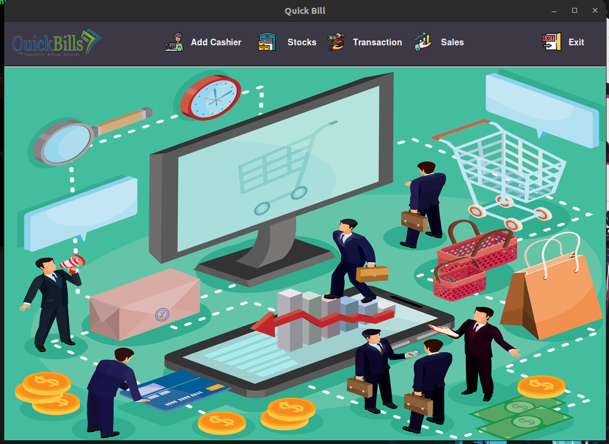
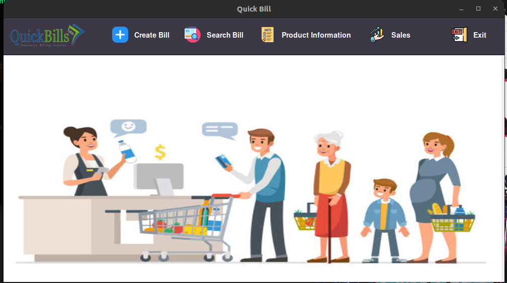

# Supermarket Billing System

The Supermarket Billing System is a Java-based application that allows users to manage billing, transactions, sales, and stock information in a supermarket. The system provides separate interfaces for both Admin and Cashier roles to perform their specific tasks efficiently.

## Features

### Admin UI

The Admin UI provides the following functionalities:

1. Login: The admin can log in using valid credentials to access the admin interface.

2. Add Cashier: Admin can add new cashier accounts to the system by providing necessary details like username and password.

3. Transactions: Admin can view and manage transaction records, including the bill details, date, and total price.

4. Sales: Admin can view sales reports and statistics to monitor the overall performance of the supermarket.

5. Stocks: Admin has the authority to update, add, and delete product information to manage the supermarket's inventory effectively.

### Cashier UI

The Cashier UI provides the following functionalities:

1. Login: The cashier can log in using valid credentials to access the cashier interface.

2. Create Bill: Cashier can create new bills for customers, adding multiple products with their respective quantities and calculating the total price.

3. Search Bill: Cashier can search and view existing bills to provide quick assistance to customers with their purchase history.

4. Sales: Cashier can view individual sales records and the total sales made during their shift.

5. Product Information: Cashier has access to view product details such as name, price, and availability to assist customers better.

## Technology Used

- Java: The application is built using Java programming language.
- Swing Framework: The user interfaces are designed using the Swing framework to create interactive and responsive GUIs.

## How to Use

1. Clone the repository to your local machine.
2. Open the project in your preferred Java IDE.
3. Run the application.
4. The application will display a login screen where you can choose between Admin and Cashier roles.
5. After successful login, you will be directed to the respective UI for performing the tasks associated with your role.

## Requirements

- Java Development Kit (JDK) 8 or above installed on your machine.
- Java IDE (e.g., Eclipse, IntelliJ) or any text editor.

## Note

- The application uses a MySQL database to store user information and other data. Make sure to configure the database connection properties in the `DB.java` class before running the application.

## Screenshots

![Admin UI](# Supermarket Billing System

The Supermarket Billing System is a Java-based application that allows users to manage billing, transactions, sales, and stock information in a supermarket. The system provides separate interfaces for both Admin and Cashier roles to perform their specific tasks efficiently.

## Features

### Admin UI

The Admin UI provides the following functionalities:

1. Login: The admin can log in using valid credentials to access the admin interface.

2. Add Cashier: Admin can add new cashier accounts to the system by providing necessary details like username and password.

3. Transactions: Admin can view and manage transaction records, including the bill details, date, and total price.

4. Sales: Admin can view sales reports and statistics to monitor the overall performance of the supermarket.

5. Stocks: Admin has the authority to update, add, and delete product information to manage the supermarket's inventory effectively.

### Cashier UI

The Cashier UI provides the following functionalities:

1. Login: The cashier can log in using valid credentials to access the cashier interface.

2. Create Bill: Cashier can create new bills for customers, adding multiple products with their respective quantities and calculating the total price.

3. Search Bill: Cashier can search and view existing bills to provide quick assistance to customers with their purchase history.

4. Sales: Cashier can view individual sales records and the total sales made during their shift.

5. Product Information: Cashier has access to view product details such as name, price, and availability to assist customers better.

## Technology Used

- Java: The application is built using Java programming language.
- Swing Framework: The user interfaces are designed using the Swing framework to create interactive and responsive GUIs.

## How to Use

1. Clone the repository to your local machine.
2. Open the project in your preferred Java IDE.
3. Run the application.
4. The application will display a login screen where you can choose between Admin and Cashier roles.
5. After successful login, you will be directed to the respective UI for performing the tasks associated with your role.

## Requirements

- Java Development Kit (JDK) 8 or above installed on your machine.
- Java IDE (e.g., Eclipse, IntelliJ) or any text editor.

## Note

- The application uses a MySQL database to store user information and other data. Make sure to configure the database connection properties in the `DB.java` class before running the application.

## Screenshots

*Admin UI with options to add a cashier, viewing transactions, view sales, and manage stocks.*

*Cashier UI for creating bills, searching bills, viewing sales, and product information.*

For any issues or inquiries, please contact [sthaaayush105@gmail.com](mailto:sthaaayush105@gmail.com).
